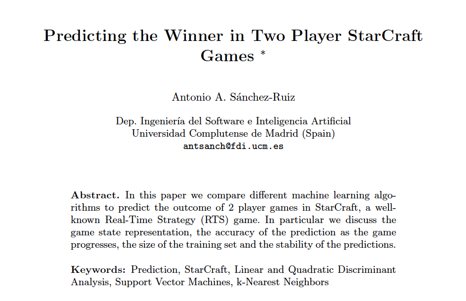
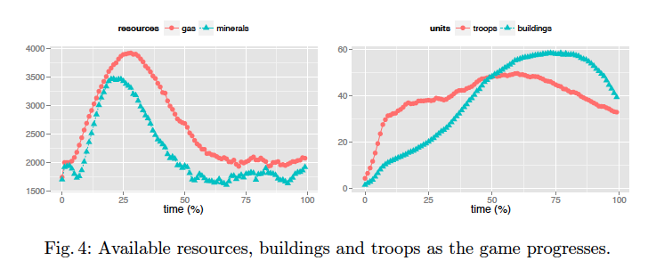
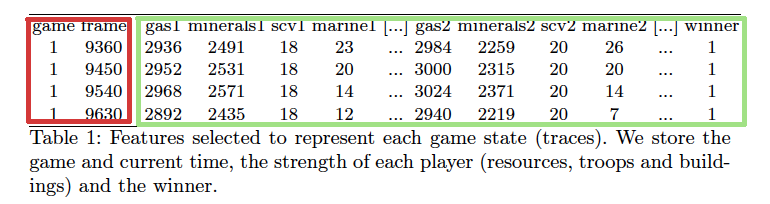
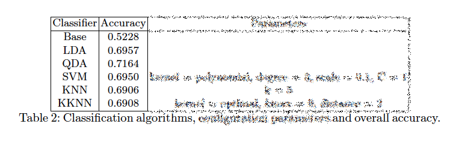
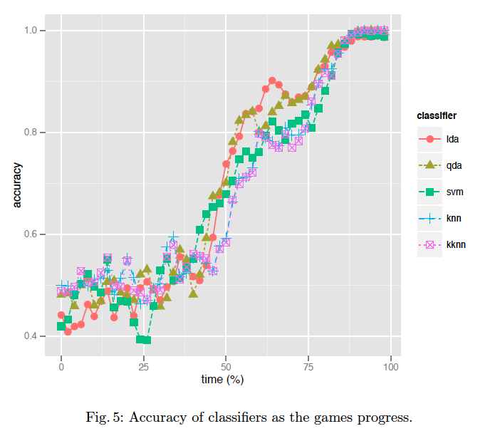

title: Explicando "Predicting the Winner in Two Player StarCraft Games"
-----
# Explicando _Predicting the Winner in Two Player StarCraft Games_ de Antonio A. Sánchez-Ruiz
Por **Víctor M. Rivas Santos** para **GeNeura Team**.

_Noviembre, 2017_



*Portada artículo original disponible en http://ceur-ws.org/Vol-1394/paper_3.pdf*

### Índice

### ¿De qué trata? (según el _abstract_)

1. Comparan varios algoritmos de _machine learning_ para predecir el resultado de partidas entre 2 jugadores en StarCraft
2. Reflexionan sobre:
  * la representación del estado del juego,
  * la bondad de la predicción,
  * el tamaño del conjunto de entrenamiento
  * y la estabilidad de las predicciones.

### ¿Qué conclusiones destacan?
1. Todos los algoritmos se comportan de modo similar, aunque los mejores resultados los obtienen con _Linear Discriminant Analysis_.

### ¿Qué trabajos futuros creen interesantes?
1. Generalizar los resultados usando mapas y bots distintos.
1. Más de 2 jugadores.
1. Más de 1 raza.
1. Considerar otros datos de entrada:
  * Distribución de unidades y edificios en el mapa
  * Considerar la evolución del juego, no solo el estado en determinados instantes.

```js
"We think there is a lot of work to do selecting features to train the classiers."
```

### ¿Qué aportan con respecto a otros autores?
* No crean bots para ganar, sino bots **observadores** que intentan predecir cuál de los otros bots va a ganar.

### ¿Por qué StarCraft?
* Un RTS popular:
  * Recolectar recursos
  * Desarrollar tecnología
  * Construir ejércitos:
    * Elegir entre 3 tipos de razas
    * Cada una con distintos tipos de unidades, puntos débiles y fuertes
  * Derrotar al enemigo
* Exige readaptar estrategias dinámicamente
  * Macro: en qué emplear los recursos y cómo usar sus unidades
  * Micro: dividir tropas en comandos, posicionarlos, decidir qué habilidades usar de dichas tropas, cuándo hacerlo...
* Se pueden crear bots usando el _framework_ [BWAPI](http://bwapi.github.io/)

### ¿Qué restricciones se han impuesto?
* Solo 1 raza: los _Terrans_

### _Machine Learning_ (I): ¿cómo han recopilado los datos?
* Crean un bot (BWAPI) que:
  * No tiene unidades y ve todo el mapa
  * No interfiere en el juego, solo recopila datos.
* Jugando partidas de *3* jugadores:
  * El bot que actúa como el _jugador humano_ obligatorio
  * 2 jugadores manejados por la IA del propio juego: _Expansion Terran Campaign Insane_
* Han modificado el mapa _Baby Steps_ (solo para 2 jugadores)
* Deshabilitan los disparadores propios del juego de modo que:
  1. El bot reinicia el juego en cuanto uno de los 2 jugadores (NO el bot) pierde
  1. No tiene en cuenta, por tanto, que las unidades del bot son 0

### _Machine Learning_ (II): ¿cuántos datos han recopilado?
* 100 partidas: 50% ganadas por cada jugador
* Multitud de _traces_ por partida:
  * 1 _trace_ cada 5 segundos
  * Cada _trace_ corresponde a un _framework_
  * 1 seg = 18 frames
  * 730 de media por partida
  * Pocas partidas rápidas. La mayoría entre 45 y 100 minutos. Media 60.83 minutos.
* Cada _trace_ es representado por un vector de características etiquetado con el ganador de la partida

### _Machine Learning_ (III): ¿alguna primera medida sobre los datos?

*Valores promediados de cada jugador para 100 partidas*

### _Machine Learning_ (IV): ¿qué características han considerado importantes?

*Estructura de los ficheros de entrenamiento y test*
* Recursos disponibles
* Número de unidades de cada tipo disponibles
* No se usan ni número de partida ni número de frame.
* Total: 28 características (2 recursos, 15 tipos de tropas, 11 tipos de edificios para _Terrans_)


### _Machine Learning_ (V): ¿qué algoritmos han utilizado?
* _Linear Discriminant Analysis_ (LDA): combinación lineal de características para separar clases; todas las clases con la misma matriz de covarianza.
* _Quadratic Discriminant Analysis_ (QDA): más flexible pues no asume la igualdad de la matriz de covarianza.
* _Support Vector Machines_ (SVM): prueban 3 kernels: polinómico (resulta ser el mejor), RBF y lineal.
* _k-Nearest Neighbour_ (KNN)
* _Weighted KNN_ (KKNN)

### _Machine Learning_ (VI): ¿cómo han implementado los algoritmos?
* R, con los algoritmos de los paquetes _caret_, _MASS_,
_e1071_, _class_ and _kknn_.

### Experimentación
* Parámetros de cada algoritmo (hallados usando 10-cvf sobre una amplia variedad de configuraciones):

*Parámetros de ejecución de cada algoritmo*
* Precisión de la clasificación (16 ejecuciones usando 80% para _trn_ y 20% para _tst_).

*Precisión en la clasificación de cada algoritmo*
* _Base_ consiste en asignar la clase usando simplemente el número de partidas ganadas por cada jugador (no tiene en cuenta el estado de cada _trace_).
* ¿Dónde está la desviación estándar?

### Discusión de resultados
* Mejor: QDA. 71%. OJO: mismo AI para ambos jugadores; mezcla de _traces_ del minuto 1 con los del minuto 87... **Muy equilibrado**.
* ¿Qué ocurre si tenemos en cuenta cómo progresan las partidas?

*Precisión de cada algoritmo conforme progresan las partidas*
* ¿Cómo hace la partición de datos? ¿Cuáles usa? ¿Cuáles no?


<!--
..........................................................................................................................................................
..........................................................................................................................................................
..........................................................................................................................................................
..........................................................................................................................................................
-->

<!--

Estilos

-->

<style>
@media screen {
  .markdown-body h1
  , .markdown-body h2
  , .markdown-body h3
  , .markdown-body img
  , h1, h2, h3, img {
    margin-top: 5em;
  }
}

nav {
  display: none;
}
.markdown-body h3
, h3 {
  padding-top: 2em;
  border-top: 1px solid black;
}

h3.ejercicio
, h3.ejercicio+* {
  border-left: solid 1px green;
  background-color: rgba( 0,127,0, 0.1);
  padding-right: 0.2em;
  padding-bottom: 1em;
}

h3.ejercicio {
  margin-bottom: 0em;
  padding-left: .5em;
  padding-bottom: .5em;
  padding-top: 0.2em;
  border-top-width: 0px;
}

h3.error
, h3.error+* {
  border-left: solid 1px red;
  background-color: rgba( 127,0, 0, 0.1);
  padding-right: 0.2em;
}

h3.error {
  color: red;
  margin-bottom: 0em;
  padding-left: .5em;
  padding-bottom: .5em;
  border-top-width: 0px;
  padding-top: 0.2em;

}

.markdown-body img
, img {
  border: 1px solid rgb(0,0,127);
  padding: 0.2em;
  text-align: center;
}

.destacar {
  font-size: bold;
  color: rgb( 0, 0, 127);
}

img {
  text-align: left;
  display: block;
}
.nav-list{
  width: 20em;
  position: relative;
}
li.sidebar-header-1,
li.sidebar-header-1 a,
li.sidebar-header-2,
li.sidebar-header-2 a,
li.sidebar-header-3,
li.sidebar-header-3 a {
  width: 20em;
  height: 1.5em;
  font-size: 7pt;
}

</style>


<!--

Funciones en JavaScript

-->
<script>
//Tratamiento de imágenes
// 1. Añado evento onclick
// 2. Redimensiono al 90% de la página
var imgs=document.getElementsByTagName( "img" );
for( var i=0; i<imgs.length; ++i ) {
  var im=imgs[i];
  im.onclick=function() { location=this.src; }
  im.title=imgs[i].alt+ " (Click para aumentar)";
  im.style="width: 50%; height: 50%; "
}

// generación del indice
var msj="";
var h2=document.getElementsByTagName("h2");
for( var i=2; i<h2.length; ++i ) {
  msj+="<p><a href='#"+h2[i].id+"'>"+h2[i].innerText+"</a></p>\n"
}

var e=document.createElement( "div" );
e.style="margin-left: 3em;"
e.innerHTML=msj;
var i=document.getElementById("1.-introducción")
i.parentNode.insertBefore(e,i );
</script>
